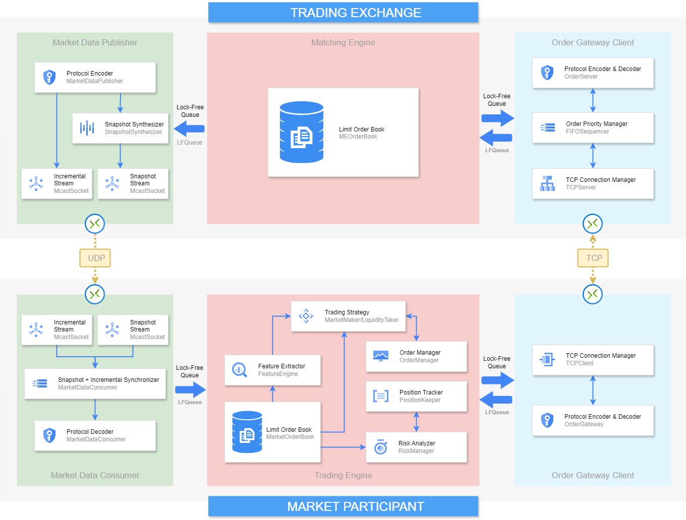

# Low Latency Trading Ecosystem

## Contents
* [Overiew](#overview)
* [Architecture](#architecture)
* [Demo Run](#demo-run)

## Overview
Trading Ecosystem is a comprehensive low-latency, high-throughput trading ecosystem developed in C++. It includes key components such as a matching engine, market data handlers, order gateways, and trading algorithms. Built from the barebones, this project doesn't rely on any external C++ libraries except STL. The effort is centered around gaining insights into designing and building high-performance trading systems from the ground up, leveraging C++ functionalities for low-latency development.

## Architecture

 

 

## Demo Run

 

 

 
